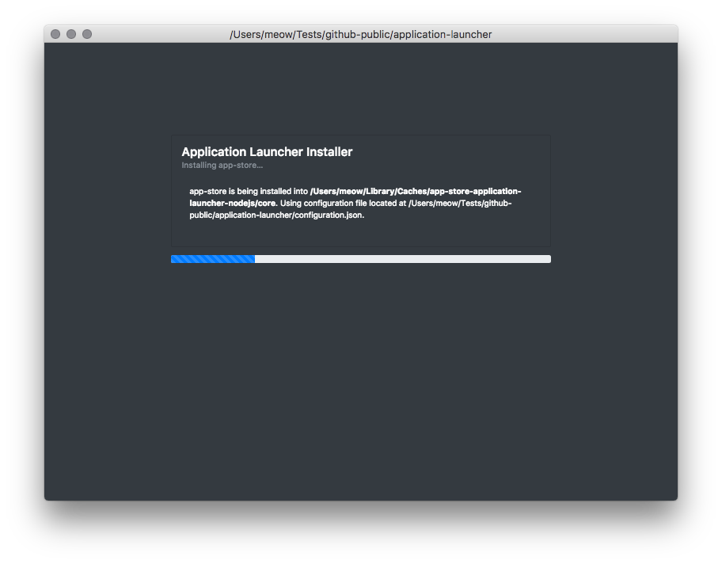

# Application Launcher
Easily install and launch electron applications from npm locations.

1. Grab a file from downloads directory
2. Locate its resource/configuration.json
3. Set application to anything on NPM.
4. Execute the main .exe

The main exe will install the npm module and launch the index.html within.



## Overview

Just edit the configuration.json to specify the name of the npm application you want to launch,
and run build.sh to rebuild the downloads directory.

## Internals

This is the GUI shell for the tiny application-installer which is a small abstraction over npm it self.
application-installer will install the package specified in configuration.json and open its index.html
triggering main.js/renderer.js of the application defined in configuration.json.

## Example

```JavaScript

// configuration.json
{
  "application": "app-store"
}


```

this configuration.json will install and launch
https://www.npmjs.com/package/app-store
available on https://github.com/fantasyui-com/app-store
